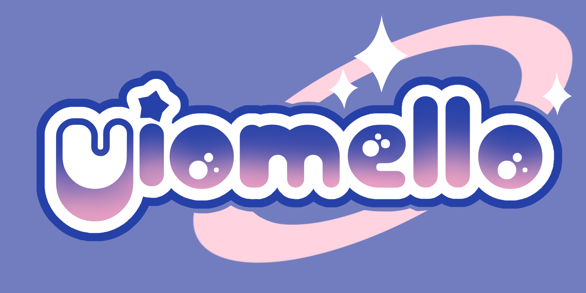

<a name="readme-top">

<br/>

<br />
<div align="center">
  <a href="https://github.com/zyx-0314/">
  <!-- TODO: If you want to add logo or banner you can add it here -->
    
  </a>
<!-- TODO: Change Title to the name of the title of your Project -->
  <h3 align="center">Final Project - ENDENO</h3>
</div>
<!-- TODO: Make a short description -->
<div align="center">
  I was tasked to create a website about a bar so I decided to make a website for an LGBTQ+ friendly bar (Optional)
</div>

<br />

<!-- TODO: Change the zyx-0314 into your github username  -->
<!-- TODO: Change the WD-Template-Project into the same name of your folder -->


---

<br />
<br />

<!-- TODO: If you want to add more layers for your readme -->
<details>
  <summary>Table of Contents</summary>
  <ol>
    <li>
      <a href="#overview">Overview</a>
      <ol>
        <li>
          <a href="#key-components">Key Components</a>
        </li>
        <li>
          <a href="#technology">Technology</a>
        </li>
      </ol>
    </li>
    <li>
      <a href="#rule,-practices-and-principles">Rules, Practices and Principles</a>
    </li>
    <li>
      <a href="#resources">Resources</a>
    </li>
  </ol>
</details>

---

## Overview

<!-- TODO: To be changed -->
<!-- The following are just sample -->
A place where you can be your most authentic self without having to worry about the judgement of others. Anyone can be the life of the party and we make sure no one will feel left out. Prismatic Pearl is here to offer comfortability, solidarity, exciting shows and of course, very fun drinks that's sure to knock your socks off. 

Guiding Question:
- What is the project : The project is about making a website based on the subject of your group.
- Whats the purpose : The purpose of this project is to apply the knowledge that we as students have during the lessons of this course pertaining to web design.
- What are key components : The key components of my website is that it's a multipage, responsive and bootstrap-embedded website.
- What technology used and how it is used : The technology that I mainly used was HTML and CSS

### Key Components
<!-- TODO: List of Key Components -->
<!-- The following are just sample -->
- Multipage Website
- Responsive 
- Bootstrap-embedded

### Technology
<!-- TODO: List of Technology Used -->


## Rules, Practices and Principles
1. Always use `WD-` in the front of the Title of the Project for the Subject followed by your custom naming.
2. Do not rename any .html files; always use `index.html` as the filename.
3. Place Files in their respective folders.
4. All file naming are in camel case.
   - Camel case is naming format where there is no white space in separation of each words, the first word is in all lower case while the succeding words first letter are in upper followed by lower cased letters.
   - ex.: buttonAnimatedStyle.css
5. Use only `External CSS`.
6. Renaming of Pages folder names are a must, and relates to what it is doing or data it holding.
7. File Structure to follow below.

```
WD-ProjectName
└─ assets
|   └─ css
|   |   └─ style.css
|   └─ img
|   |   └─ fileWith.jpeg/.jpg/.webp/.png
|   └─ js
|       └─ script.js
└─ pages
|  └─ pageName
|     └─ assets
|     |  └─ css
|     |  |  └─ style.css
|     |  └─ img
|     |  |  └─ fileWith.jpeg/.jpg/.webp/.png
|     |  └─ js
|     |     └─ script.js
|     └─ index.html
└─ index.html
└─ readme.md
```

## Resources

<!-- TODO: Add References -->
| Title | Purpose | Link |
|-|-|-|
| Nectar Nightclub | Manila's #1 DJ-Driven LGBTQI+ nightclub in the heart of BGC.  | https://www.facebook.com/nectarofmanila/|
